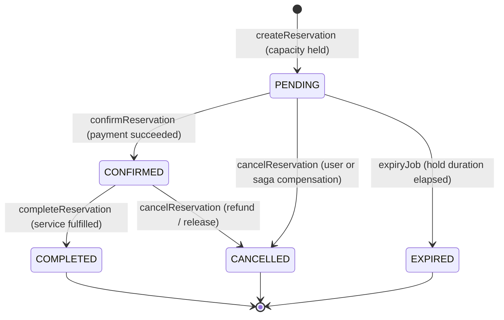
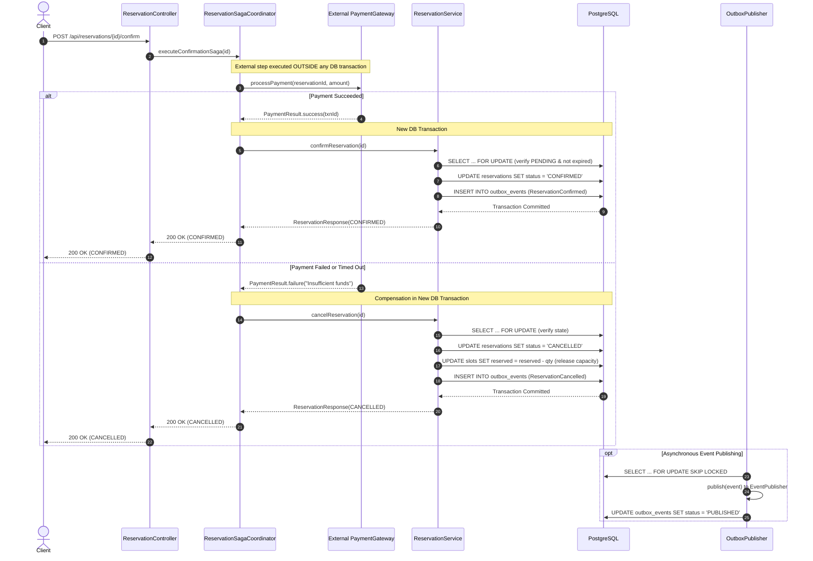

# State Machine & Saga Flow

This document details the state lifecycle of reservations and the sequence diagram for the confirmation saga.

---

## 1. Reservation State Machine

### Transition Matrix

| From State | Allowed Transitions | Disallowed Transitions | Terminal? | Notes |
| :--- | :--- | :--- | :--- | :--- |
| **`PENDING`** | `CONFIRMED`, `CANCELLED`, `EXPIRED` | `PENDING`, `COMPLETED` | No | Initial state. Capacity is held in slot. |
| **`CONFIRMED`**| `COMPLETED`, `CANCELLED` | `PENDING`, `CONFIRMED`, `EXPIRED` | No | Capacity held. Confirming again is idempotent. |
| **`CANCELLED`**| None | All | **Yes** | Cancelling again is idempotent. Slot capacity is released. |
| **`EXPIRED`**  | None | All | **Yes** | Expired by background job. Capacity released. |
| **`COMPLETED`**| None | All | **Yes** | Terminal state. |

---

## 2. Confirmation Saga Flow (Orchestration)

The saga ensures that slow, network-bound external steps (e.g., payment gateway) do not hold database connections or row locks open.

---

## 3. Crash Recovery & Resilience

* **Service Crash Before Payment**: The reservation remains `PENDING`. When `expires_at` is reached, `ReservationExpiryJob` acquires the row via `SELECT ... FOR UPDATE SKIP LOCKED`, transitions it to `EXPIRED`, releases the held capacity, and writes a `ReservationExpired` outbox event.
* **Service Crash After Payment But Before Confirm**: If the payment gateway succeeds but the service crashes before confirming, the transaction can be safely reconciled via idempotency or payment webhook replay.
* **Duplicate Saga Calls**: Calling confirm on an already `CONFIRMED` reservation returns the current state immediately without duplicate external charges or errors.
